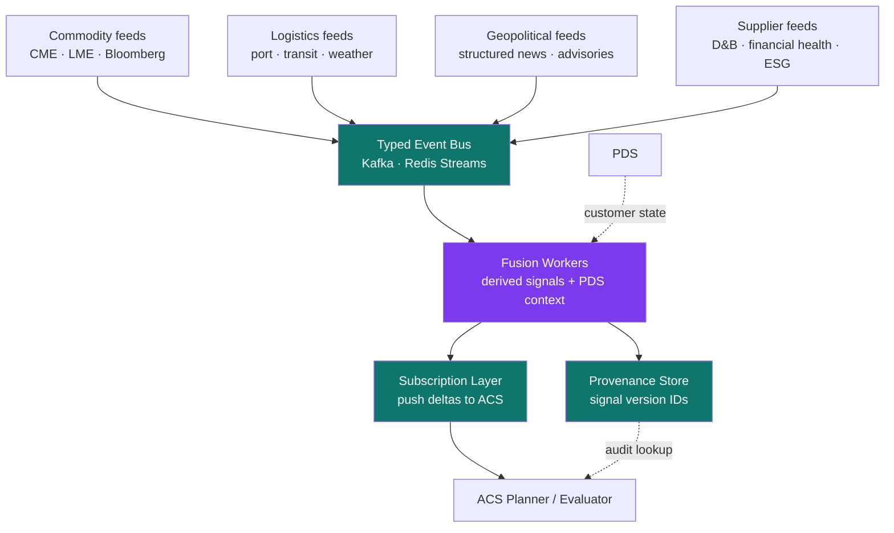

<div align="center">

# External Signal Fabric

**The missing peer to PDS. Production patterns for fusing customer-external state — markets, logistics, geopolitics, supplier health, weather — with customer-internal state into a single decision substrate AI agents can reason over.**

[](LICENSE-CC-BY-4.0)
[](LICENSE-MIT)
[](SPEC.md)
[](https://github.com/drewmattie-code/Progressive-Discovery-Spine)
[](https://github.com/drewmattie-code/Adversarial-Coordination-Spine)

</div>

---

## What this is

ESF is a pattern for the **optional capability** that gives AI agents access to external-world signals when they need them.

ESF is not required for every decision. Most agent decisions can be made from customer-internal data alone (resolved through PDS) without ever consulting an external signal. ESF is what's available when the agent's decision *would be more accurate* with external context — when interpretation of a customer fact depends on a world fact the agent cannot otherwise see.

Examples of when ESF engagement pays off:

- An agent considering an open PO with Supplier X benefits from knowing Supplier X's current financial health
- An agent routing inbound inventory benefits from knowing current port dwell and weather
- An agent reasoning about commodity exposure benefits from knowing the current commodity strip
- An agent evaluating a regional supplier benefits from knowing the current geopolitical advisory state

When ESF is engaged, the fabric:

- Ingests **typed, timestamped, sourced signals** from heterogeneous external feeds — commodity prices, port dwell, supplier financial health, weather, geopolitical events
- Wraps raw signals as **Fusions** that combine external signals with PDS-resolved internal state — the moat lives here, not in the raw feeds
- Pushes deltas to subscribers via **subscriptions**, not polls — keeping ACS planner context windows free of noise
- Exposes a **three-state freshness contract** — live / stale / expired — so the ACS evaluator can decide what to do with each signal class
- Carries **signal-version provenance** through to the ACS audit log so failure post-mortem can attribute to a specific signal at a specific timestamp

The result: agents that reason over the world *and* the customer when the situation calls for it, with a typed substrate that survives the audit when things go wrong.

## Why it exists

Four failure modes recur when teams wire external-signal integration into agents naively. ESF addresses them by treating external signals as a structured, opt-in capability rather than ad-hoc bolt-ons.

1. **Signal pollution.** Feeds without filtering drown the consumer in irrelevant noise. The agent's context fills with weather data when the question is about supplier financial health, and the meaningful delta gets lost. ESF answers this with typed signals + push subscriptions: agents only see signal classes they subscribed to.
2. **Stale-signal commitments.** Actions taken on expired data — port dwell from six hours ago, a financial-health datapoint from last quarter — produce confidently wrong decisions. The signal was correct when ingested and wrong when used. ESF answers this with the three-state freshness contract: every signal exposes live/stale/expired so the consumer can decide.
3. **Provenance gaps.** When the agent produces an output that turns out to be wrong, post-mortem can't attribute the failure to a specific signal version. Was it the model? The internal data? The external feed? The fusion logic? Without signal-version provenance, you can't tell. ESF answers this with signal-version IDs propagated to the audit log.
4. **Commodity trap.** Raw signal feeds are a commodity — anyone can buy a weather API, a commodity-price feed, or a supplier-health subscription. Building a system that exposes only raw signals is building a category Everstream, Resilinc, Interos, and Project44 already won. **Fusions against customer-specific PDS context are the moat. Raw signals are not.** ESF answers this by making Fusions a first-class primitive distinct from raw Signals.

ESF is the implementation pattern that addresses all four — when teams choose to enable external-signal capabilities for their agents.

## Architecture



Lateral, not sequential. Many feeds, many fusion workers, many consumers. No single path through the fabric — ACS planners pull cross-sections relevant to their workstream while ignoring the rest.

## Where ESF fits in the stack

The Model Context Protocol (MCP) is the protocol layer. The Progressive Discovery Spine (PDS) handles customer-internal data discipline. ESF handles external-signal fusion. The Adversarial Coordination Spine (ACS) coordinates agents that consume both.

```
┌──────────────────────────────────────────────────┐
│ User · Product · Long-running Task               │
└────────────────────┬─────────────────────────────┘
                     ↓
┌──────────────────────────────────────────────────┐
│ Adversarial Coordination Spine (ACS)             │  ← multi-agent
│ Planner / Generator / Evaluator                  │
└──────────┬────────────────────┬──────────────────┘
           ↓                    ↓
┌──────────────────┐   ┌────────────────────────┐
│ Progressive      │   │ External Signal Fabric │  ← THIS spec
│ Discovery Spine  │   │ typed signals · fusions │
│ (PDS)            │   │ subscriptions · freshness│
│ customer state   │   │ external state          │
└──────────┬───────┘   └────────────┬───────────┘
           ↓                        ↓
┌──────────────────┐   ┌────────────────────────┐
│ Model Context    │   │ Feed Adapters           │
│ Protocol (MCP)   │   │ commodity · logistics · │
└──────────┬───────┘   │ geo · supplier · weather│
           ↓           └────────────────────────┘
┌──────────────────┐
│ Customer         │
│ Backends         │
└──────────────────┘
```

PDS answers *"what is true inside this customer's four walls?"* ESF answers *"what is true in the world that should change how we interpret what's inside the four walls?"* Neither is sufficient alone. ACS reasons across both.

## The 10 principles

| # | Principle | The shift |
|---|---|---|
| 01 | **Fusion is the moat, raw signal is the commodity** | Anyone can buy a weather feed. Fusions of external signals with customer-specific PDS context are non-commodity. Design the fabric around fusions. |
| 02 | **Lateral fabric, not sequential spine** | Many feeds, many fusion workers, many consumers. No single path. Topology shapes naming: "Fabric" because it isn't "Spine." |
| 03 | **Typed signals with structured payloads** | Every signal carries source ID, ingestion timestamp, confidence band, half-life, and structured payload. No unstructured feed text reaches downstream consumers. |
| 04 | **Push subscriptions, not poll** | Consumers subscribe to signal classes and receive deltas. ACS planner context windows do not fill with poll responses. |
| 05 | **Three-state freshness contract** | Every signal exposes `live` / `stale` / `expired` keyed to a per-class half-life. When a commitment depends on an ESF signal, the consumer MUST check freshness; expired signals MUST NOT be used for commitments. |
| 06 | **Bidirectional fusion triggers** | Two patterns: PDS-anchored (PDS surfaces fact → ESF enriches) and ESF-anchored (ESF detects delta → PDS queried for customer exposure). Both produce fused decision objects ACS consumes. |
| 07 | **Tiered latency budgets** | Each fusion declares a tier — realtime (<1s), near-realtime (<60s), batch (hourly+). The bus enforces. |
| 08 | **Tenant-scoped fusion, shared raw signals** | Raw signals are global (port dwell at Long Beach is the same for everyone). Fusions cache per-tenant because they depend on PDS context. |
| 09 | **Per-fusion degradation declaration** | Each fusion declares `confidence_on_esf_absence`: `blocking` / `degraded` / `unaffected`. ACS evaluator respects per-fusion, not global policy. |
| 10 | **Signal-version provenance, not signal-class** | Audit records reference specific signal version IDs (not just "we used port data"). Failure attribution must reach the exact signal at the exact timestamp. |

Full discussion of each principle, with problems, patterns, and implementation notes, lives in [SPEC.md](SPEC.md).

## The four-way failure attribution principle

ESF is the third spec in a catalog whose meta-architectural contribution is a complete failure-attribution dictionary. When something goes wrong in an agent-driven decision, post-mortem can attribute the failure cleanly to one of four sources:

| Attribution | Owned by | "Failure looked like..." |
|---|---|---|
| **Bad customer data** | PDS | Wrong supplier ID returned, stale internal cache, missing record |
| **Bad world data** | ESF | Expired weather signal, port dwell from old version, mis-tagged geopolitical advisory |
| **Bad reasoning** | ACS Planner | Granular plan that assumed conditions that no signal supported |
| **Bad evaluation** | ACS Evaluator | Rubber-stamped output that violated the contract |

Without the three-spec catalog, this dictionary doesn't exist and post-mortems devolve into "the AI was wrong." With it, the failure is locatable, ownable, and fixable.

## Industry context — convergence on the same pattern

ESF is not a novel invention. It's a formalization of a pattern that production teams have independently converged on across stream-processing infrastructure, financial signal fusion, and supply-chain visibility platforms. The pattern crystallized in late 2025 / early 2026 as AI agents started consuming external signals at scale. ESF synthesizes that convergence into a single referenceable specification.

### Stream substrate (the typed event fabric layer)

**Apache Kafka — Event Streaming.** Kafka's foundational framing of typed event streams as substrate: *"Event streaming is the practice of capturing data in real-time from event sources like databases, sensors, mobile devices, cloud services, and software applications in the form of streams of events."* [Source](https://kafka.apache.org/intro)

**Apache Flink — Event Time and Watermarks.** Flink's watermarks are the academic-quality reference for the three-state freshness contract: *"A Watermark(t) declares that event time has reached time t in that stream, meaning that there should be no more elements from the stream with a timestamp t' <= t."* [Source](https://nightlies.apache.org/flink/flink-docs-release-1.18/docs/concepts/time/)

**CloudEvents (CNCF).** The canonical industry standard for typed event metadata: *"A specification for describing event data in a common way."* [Source](https://cloudevents.io/)

**Materialize — Real-time Context.** Materialize ships incremental materialized views with freshness guarantees: *"Transform siloed data into up-to-the-second context, just using SQL."* [Source](https://materialize.com/)

### Financial signal fusion (the multi-billion-dollar proof)

**Bloomberg — B-PIPE.** Bloomberg's B-PIPE is the canonical typed-financial-feed substrate underlying the Terminal: *"The Bloomberg Market Data Feed (B-PIPE) enables global connectivity to consolidated, normalized market data in real time."* [Source](https://professional.bloomberg.com/products/data/enterprise-catalog/real-time-data-feed/)

**Kensho (S&P Global) — Extract.** Kensho's signal extraction is the canonical "unstructured-to-structured" capability inside S&P Global: *"Transforms unstructured PDFs into AI-ready data with fast and reliable document extraction across text, tables, and figures."* [Source](https://kensho.com/solutions)

**AlphaSense — Financial + Unstructured Fusion.** AlphaSense explicitly frames the structured-plus-unstructured fusion thesis: *"By uniting structured financial information with unstructured proprietary business content in a single workflow, customers gain more complete answers and make faster, better-informed decisions."* [Source](https://www.alpha-sense.com/press/alphasense-launches-financial-data/)

### Supply-chain visibility (the direct-category convergence)

**Everstream Analytics.** Everstream sells signal fusion as a category: *"Integrating real-time data, expertise, data science, and AI & NLP for complete supply chain risk management."* [Source](https://www.everstream.ai/)

**Resilinc — EventWatchAI.** Resilinc's continuous-scanning agentic monitoring: *"continuously scan news outlets, social media, and government reports across 100+ languages and 200 countries."* [Source](https://resilinc.ai/products/agentic-ai-supply-chain-monitoring/)

**project44 — Movement.** project44 frames its logistics fabric explicitly: *"the world's largest, most accurate, real-time logistics data graph."* [Source](https://www.project44.com/platform/visibility/)

**Interos.** Interos's multi-domain risk fusion: *"interos.ai uses AI to continuously map and monitor 400 million+ companies and billions of relationships against multiple risk signals."* [Source](https://www.interos.ai/our-software)

### Provenance & lineage (the audit-trail substrate)

**OpenLineage.** The canonical open standard for data lineage: *"OpenLineage is an open platform for collection and analysis of data lineage. It tracks metadata about datasets, jobs, and runs, giving users the information required to identify the root cause of complex issues and understand the impact of changes."* [Source](https://openlineage.io/)

**W3C PROV.** The bedrock provenance standard: *"Provenance is information about entities, activities, and people involved in producing a piece of data or thing, which can be used to form assessments about its quality, reliability or trustworthiness."* [Source](https://www.w3.org/TR/prov-overview/)

### What ESF contributes

The sources above document INDIVIDUAL implementations and isolated primitives. ESF contributes:

1. A unified set of **10 principles** mapped to four documented failure modes
2. **Target SLAs** for production signal-fabric readiness
3. An **8-step build sequence** from skeleton to first reference deployment
4. **Anti-patterns** to avoid
5. A **portable, citable specification** under CC BY 4.0 — adopt, adapt, build commercial products on top, with attribution
6. **Explicit composition with PDS and ACS** — the four-way failure attribution dictionary that the three-spec catalog enables

If your team is independently converging on this pattern (as Bloomberg, Kafka, Everstream, Resilinc, and others already have at their respective layers), ESF gives you a vocabulary, a checklist, and a published artifact you can hand to your peers.

## What good looks like (target SLAs)

| Metric | Target | Why it matters |
|---|---|---|
| Realtime signal end-to-end latency (p95) | < 1,000 ms | Bus + adapter + fusion must clear realtime tier |
| Near-realtime signal end-to-end latency (p95) | < 60 s | Most signal classes live here |
| Commitments made on expired ESF signals | 0 | When ESF is engaged, expired signals must not back commitments |
| Signal-version provenance completeness | 100% | Every fusion result references its signal version IDs |
| Subscription delta-loss rate | < 0.01% | Subscriptions are the load-bearing consumer surface |
| Fusion hit rate (per-tenant cache) | > 50% | Cache earns its keep against PDS-fetch cost |
| Raw signal global cache hit rate | > 90% | Raw signals are global; cache aggressively |
| Adapter failure recovery time | < 5 min | Per-adapter circuit breaker + retry |
| Time from adapter onboarding to first fused signal | < 1 day | New feed should not be a quarter-long project |

## Reference build sequence

ESF is built in sequence — skeleton through to first production reference deployment. Each step depends on the previous one. Pace varies by team and tooling; the sequence does not.

| Step | Deliverable |
|---|---|
| 1 | Typed signal schema · one adapter (free feed like NOAA) · Redis Streams bus · basic provenance store |
| 2 | Second adapter from a different signal class (e.g., commodity prices via public CME) · proves bus generality |
| 3 | First fusion worker — PDS-anchored pattern (PDS fact → ESF enrichment) |
| 4 | Subscription layer · ACS planner subscribes to fusion class · end-to-end trace |
| 5 | Three-state freshness contract enforced · evaluator rejection on expired signals |
| 6 | First paid feed adapter (e.g., D&B supplier health) · ESF-anchored fusion pattern (delta → PDS query) |
| 7 | Per-fusion degradation declaration · multi-tenant fusion cache · production-readiness |
| 8 | Spec / one-pager / case study |

See [SPEC.md](SPEC.md#5-build-sequence) for details.

## Who this is for

- **Enterprise platform teams** wiring AI agents into external-signal feeds — when the prototype that worked on one feed chokes on the second
- **Supply-chain risk teams** evaluating Everstream / Resilinc / Project44 / Interos — this is the architectural pattern those vendors implement; ESF gives you the vocabulary to evaluate them
- **Financial services teams** building real-time signal-fusion against Bloomberg / Kensho / AlphaSense / news APIs
- **AI engineers** building long-running agents that need to reason about the world, not just the customer
- **CTOs and architects** evaluating multi-feed integration for production rollout

## What this is not

- Not a library you install. It's an architectural pattern with reference SLAs and examples.
- Not a replacement for any specific event bus or fabric. Kafka, Pulsar, Redis Streams, Materialize, Estuary Flow, Tinybird all work as substrate.
- Not a feed provider. ESF describes the pattern for *consuming* external feeds, not for producing them.
- Not a substitute for PDS or ACS. ESF handles external signals; PDS handles customer-internal data; ACS coordinates agents that consume both.

## Use it with Claude (or any AI coding agent)

ESF ships with a [Claude Code skill](dist/skills/esf/SKILL.md) that turns the spec into an active architectural consultant inside your AI coding session. Install:

```bash
mkdir -p ~/.claude/skills/esf
curl -fsSL https://raw.githubusercontent.com/drewmattie-code/External-Signal-Fabric/main/dist/skills/esf/SKILL.md \
  -o ~/.claude/skills/esf/SKILL.md
```

After install, the skill auto-activates whenever you ask Claude about external-signal integration, supply-chain risk feeds, signal fusion, freshness contracts, or any of the other triggering contexts. It diagnoses which of the four documented failure modes you're hitting and recommends which of the 10 principles to apply.

Works in Claude Code natively. The SKILL.md format is portable — drop it into Cursor, Codex, or any agent that supports the convention.

## Examples

The [`examples/`](examples/) directory has concrete artifacts:

- [`signal-manifest.example.json`](examples/signal-manifest.example.json) — what a typed signal with provenance + freshness metadata looks like
- [`fusion-protocols.md`](examples/fusion-protocols.md) — the two bidirectional fusion patterns (PDS-anchored, ESF-anchored) worked end-to-end
- [`evaluator-rejection-on-expired-signal.md`](examples/evaluator-rejection-on-expired-signal.md) — what enforcement of the three-state freshness contract looks like in the ACS evaluator

## Citing this work

If you reference ESF in a paper, talk, blog post, or vendor architecture, please cite it. A machine-readable citation file is in [CITATION.cff](CITATION.cff). Suggested citation:

> Mattie, D. (2026). *External Signal Fabric: An architectural pattern for fusing external-world signals into a decision substrate for AI agents.* https://github.com/drewmattie-code/External-Signal-Fabric

## Contributing

Issues, examples, implementation reports, and adapter patterns welcome. See [CONTRIBUTING.md](CONTRIBUTING.md).

## License

- **Spec, documentation, diagrams** — [Creative Commons Attribution 4.0 (CC BY 4.0)](LICENSE-CC-BY-4.0). Use it, adapt it, build commercial products on top — credit the source.
- **Code samples and examples** — [MIT](LICENSE-MIT).

See [LICENSE](LICENSE) for the summary.

## Catalog

ESF is one of three specifications in the same architectural catalog:

- **[PDS — Progressive Discovery Spine](https://github.com/drewmattie-code/Progressive-Discovery-Spine)** — customer-internal tool / data discipline
- **ESF — External Signal Fabric** *(this spec)* — customer-external signal fabric
- **[ACS — Adversarial Coordination Spine](https://github.com/drewmattie-code/Adversarial-Coordination-Spine)** — multi-agent coordination layer

PDS and ESF are peers; ACS consumes from both. Together they form the four-way failure attribution dictionary documented above.

## Author

[Drew Mattie](https://www.linkedin.com/in/drew-mattie-88084826/) · SaaSquach AI Labs (a division of Charles & Roe Inc.) · 2026
